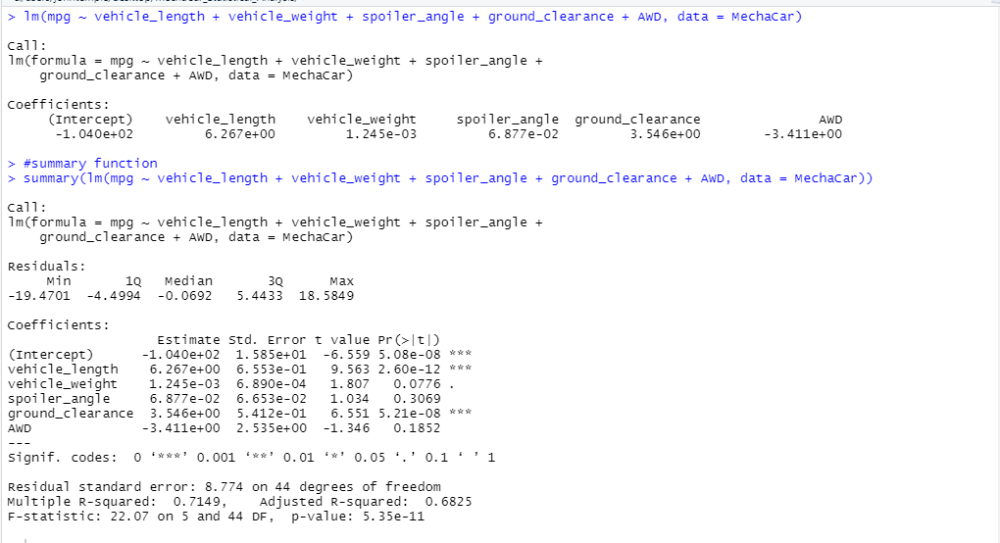
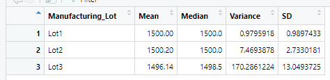
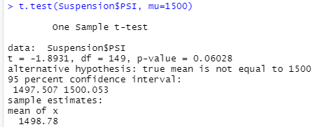
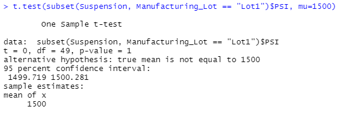
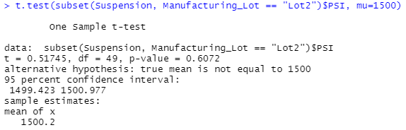
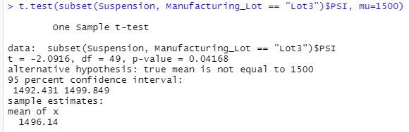

# MechaCar_Statistical_Analysis
## Linear Regression to Predict MPG

The variables that provide a non-random amount of variance to the MPG of a car are the vehicle length and ground clearance because they're p values are so low that they are statistically significant.
The slope of the linear model is not considered to be zero because all slope values are positive except for the AWD variable. While this has a relatively high absolute value, there are two other variables that have higher absolute values.
This model does effectively predict mpg in the MechaCar prototypes because the p-value is extremely low, indicating statistcal significance.
## Summary Statistics on Suspension Coils

When looking at the Total_Summary data frame, the Suspension Coil variance is below the 100 PSI requirement. However, when breaking it down by lot in the Lot_Summary, Lot1 and Lot2 meet this criteria, but Lot3 is above this requirement with a variance of 170.\
## T-Tests on Suspension Coils

In the t-test calculations, we used a 0.05 significance value. Using the value we found when looking at all PSI, there was not statistical significance because it was above 0.05.

Looking at just Manufacturing Lot 1, the p-value was 1 and so we refused to reject the null hypothesis.

Looking at just Manufacturing Lot 2, the p-value was .6 and so we again refused to reject the null hypothesis.

Looking at just Manufacturing Lot 3, the p-value was .04 and so we rejected the null hypothesis.

## Study Design: MechaCar vs. Competition
If we were to look at how MechaCar compares to it's competition, we would compare the average MPG of MechaCars vs. its competitors. 
Our null hypothesis would be that there is not a difference in MPG and alternative hypothesis would be there is a significant difference. We would need to gather data of competitors to understand the difference in MPG and run a t-test.